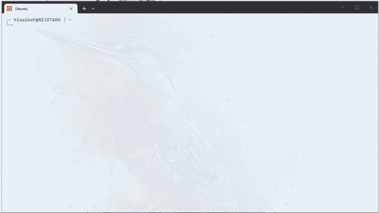

# agentic-oshikatsu

[](LICENSE)
[](https://www.npmjs.com/package/agentic-oshikatsu)
[](https://github.com/HisuiKoh/agentic-oshikatsu/actions/workflows/ci.yml)
[](https://nodejs.org/)

推し活 × AI のエージェンティック CLI ツール。

推しを登録するだけで、AI が情報を集めて分析し、行動を提案し、リスクを評価する。予算管理まで統合した、あなたの推し活アシスタント。



## インストール

```bash
npm install -g agentic-oshikatsu
```

## はじめかた

```bash
oshi
```

これだけ。TUI ダッシュボードが起動して、初期セットアップから推しの登録まですべてガイドします。

## できること

- **推し登録** — AI が対話形式であなたの推しを分析・登録。人物、キャラ、建築物、鉱物、学問、概念... あらゆる対象に対応
- **情報収集** — Google News、YouTube、Wikipedia、X (旧 Twitter) から推しの最新情報を自動収集・AI 要約
- **行動提案** — 収集した情報と予算を踏まえた推し活の提案を AI が生成
- **推し活 Linter** — 炎上リスク、犯罪リスク、推しへの悪影響、予算超過を事前にチェック（PASS / WARN / BLOCK の 3 段階）
- **予算管理** — 推し活費 + AI API コスト + 外部 API コストの 3 層統合管理
- **ダッシュボード** — 全体像をひと目で把握できる TUI ダッシュボード

## 必要なもの

- Node.js >= 20
- AI 機能を使うには以下のいずれか:
  - Claude API キー（`ANTHROPIC_API_KEY` 環境変数）
  - Codex CLI（`codex exec`）
- Linux / macOS（Windows は WSL2）

## 哲学

- AI はツール。推しの代替にはならない
- 推し活で自分が辛くなったり、人を悲しませることがあってはならない
- 推しの対象は無限大

詳しくは [ETHICS.md](./ETHICS.md) をご覧ください。

<details>
<summary>開発</summary>

### 技術スタック

- TypeScript (strict mode)
- CLI: @clack/prompts + ink (TUI)
- DB: Drizzle ORM + SQLite (WAL)
- AI: Claude (@anthropic-ai/sdk) + Codex (codex exec)
- Lint/Format: Biome
- Validation: Zod
- Test: Vitest

### セットアップ

```bash
git clone https://github.com/HisuiKoh/agentic-oshikatsu.git
cd agentic-oshikatsu
pnpm install
```

### コマンド

```bash
pnpm build        # TypeScript ビルド
pnpm test         # テスト実行
pnpm check        # Lint チェック
pnpm check:fix    # Lint + Format 自動修正
pnpm db:generate  # マイグレーション生成
```

### ディレクトリ構造

```
bin/oshi.ts              # CLI エントリポイント
src/
├── cli/                 # CLI ルーティング・コマンド・TUI
├── core/                # ビジネスロジック
│   ├── oshi/            # 推し管理
│   ├── budget/          # 予算管理
│   ├── linter/          # 推し活 Linter
│   ├── suggest/         # 行動提案
│   ├── profile/         # ユーザープロファイル
│   ├── backup/          # バックアップ・エクスポート
│   ├── dashboard/       # ダッシュボード集計
│   └── info-collection/ # 情報収集
├── infrastructure/      # 外部接続
│   ├── ai/              # AI プロバイダー
│   ├── auth/            # 認証管理
│   ├── config/          # 設定管理
│   ├── db/              # DB スキーマ・マイグレーション
│   ├── notifications/   # Discord 通知
│   └── plugins/         # 情報収集プラグイン
└── shared/              # 共通ユーティリティ
tests/
├── unit/                # ユニットテスト
└── e2e/                 # E2E テスト
```

</details>

## コントリビューション

コントリビューションを歓迎します。詳しくは [CONTRIBUTING.md](./CONTRIBUTING.md) をご覧ください。

## ライセンス

[Apache License 2.0](./LICENSE)
